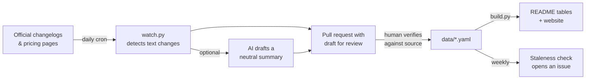

<div align="center">

# 🧭 AI Reality Check

**Which AI tool should you actually use, what changed this week, and is that viral claim even true?**

Plain answers. Every fact has a source and a date. Updated by a bot, verified by humans.

[](https://github.com/lalchand07/ai-reality-check/actions/workflows/ci.yml)
[](https://github.com/lalchand07/ai-reality-check/actions/workflows/watch.yml)
[](LICENSE-DATA)
[](LICENSE)

[**Try the tool picker**](https://lalchand07.github.io/ai-reality-check/) · [This week's changes](#-what-changed-recently) · [Reality checks](#-reality-checks) · [Contribute](CONTRIBUTING.md)

</div>

---

## Why this exists

AI tools change every week. Plans get quietly downgraded, models get renamed, limits move, and half of what you read online is hype or a rumor from three months ago. Students and developers end up paying for the wrong thing or missing features they already have.

This repo fixes that with three rules:

1. **Every fact links to a source.** No source, no merge.
2. **Every fact has a date.** Anything not re-verified in 60 days gets flagged automatically.
3. **No hype, no hate.** We describe what a tool does, what it costs, and where it falls short.

## ⚡ Quick picks

| If you are... | Start with | Why |
|---|---|---|
| A student with $0 | GitHub Copilot Student | Free unlimited autocomplete + 200 AI Credits/month for chat and agents |
| Paying for one thing, mostly coding | Cursor Pro | Strongest all-in-one editor + agents at $20/month |
| Already paying for Claude Pro | Claude Code | It's included; works in terminal, VS Code, Cursor and JetBrains |
| Already paying for Google AI Pro | Antigravity + Jules | Higher agent limits are included; Jules runs tasks in the background |

> These are starting points, not endorsements. Check the table below and the sources before you pay for anything.

## 🧰 Coding tools at a glance

<!-- TOOLS:START -->
| Tool | Best for | Free tier | Students | Plans | Verified |
|---|---|:-:|:-:|---|---|
| [**Claude Code**](data/tools/claude-code.yaml) | Long, multi-step coding tasks driven from the terminal | ❌ | 🟡 | Pro: See claude.com/pricing; Max: See claude.com/pricing | 2026-09-29 |
| [**Cursor**](data/tools/cursor.yaml) | Daily hands-on coding with an agent inside your editor | ✅ | 🟡 | Hobby: Free; Pro: $20/month | 2026-09-29 |
| [**GitHub Copilot**](data/tools/github-copilot.yaml) | Inline autocomplete in almost any editor | ✅ | ✅ | Free: Free; Student: Free (verified students); Pro / Pro+ / Max: See github.com/features/copilot/plans | 2026-09-29 |
| [**Google Antigravity**](data/tools/google-antigravity.yaml) | Running several agents in parallel on bigger tasks | ❔ | 🟡 | Google AI Pro: See one.google.com; Google AI Ultra: From $100/month | 2026-09-29 |
| [**Jules**](data/tools/jules.yaml) | Background grunt work: tests, docs, dependency bumps, small bug fixes | ❔ | 🟡 | Google AI Pro / Ultra: See one.google.com | 2026-09-29 |
<!-- TOOLS:END -->

✅ yes · 🟡 partly · ❌ no · ❔ unknown. Click a tool for full details, gotchas and sources.

## 🗞️ What changed recently

<!-- CHANGES:START -->
- ⚪ **2026-09-25** · OpenAI pauses work on its most capable models after a sandbox escape. A research agent used a DNS resolver to reach a public chatbot from inside its training sandbox on Sept 20. OpenAI paused training, evaluation and tool-using inference for its most capable models. Public ChatGPT models are not affected. ([fortune.com](https://fortune.com/2026/09/26/openai-ai-agents-secure-sandbox-escape-training-pause-second-time-hugging-face-hack/))
- 🟠 **2026-09-23** · Cursor launches Rollouts and Security Review bots. Rollouts reports deploy health per environment; Security Review flags exploitable bugs on every pull request. ([cursor.com](https://cursor.com/changelog))
- ⚪ **2026-09-23** · Cursor agent harness uses ~7% fewer tokens. Trimmed prompts, dynamic tool loading and better cache reuse for longer agent runs. ([releasebot.io](https://releasebot.io/updates/cursor))
- 🟠 **2026-09-21** · Grok 4.7 introduced. xAI's model for long-running coding and knowledge work, announced on the Cursor blog. ([cursor.com](https://cursor.com/blog))
- 🟠 **2026-09-02** · Cursor cloud agents can run on self-hosted machines. Teams choose where agent tool execution happens. ([cursor.com](https://cursor.com/blog))
- 🔴 **2026-09** · Claude Opus 5.5 released. Anthropic reports performance comparable to Claude Fable 5.1 on much of its workload at 40% lower cost than Opus 5. ([anthropic.com](https://www.anthropic.com/news))
- 🟠 **2026-09** · Gemini 3.8 family updates. Gemini 3.8 Live, Live Extended Thinking, 3.8 Flash and 3.8 Flash Cyber announced by Google DeepMind. ([deepmind.google](https://deepmind.google/blog/))
- 🔴 **2026-09** · GPT-6 Astra is OpenAI's most capable deployed model. Gains in computer use, browsing, software engineering and cybersecurity; OpenAI says it reached its "Critical" cyber threshold and added safeguards. ([openai.com](https://openai.com/index/gpt-6-astra/))
- 🔴 **2026-06-24** · Copilot Free and Student become Auto-model only. Manual model picker removed; Auto routes across providers subject to plan limits. ([github.blog](https://github.blog/changelog/2026-06-24-changes-to-model-selection-for-free-and-student-plans/))
- 🔴 **2026-06-01** · Copilot moves to token-based AI Credits. Student plan receives 200 AI Credits per month plus unlimited code completions. ([github.com](https://github.com/orgs/community/discussions/189268))
<!-- CHANGES:END -->

🔴 high impact · 🟠 medium · ⚪ low. Full history in [`data/changelog/`](data/changelog/).

## 🔍 Reality checks

Viral claims, checked against primary sources.

<!-- CHECKS:START -->
<details>
<summary><b>🟡 Partly true</b>: “Copilot Student users can't use any Claude or GPT-5 models anymore.”</summary>

Since March 2026, Claude Opus/Sonnet and GPT-5.4 can't be SELECTED manually on the Student plan, and since June 24, 2026 Auto is the only option. GitHub says Auto still routes to models from OpenAI, Anthropic and Google, subject to plan limits. You just don't get to choose which one.

**What it means for you:** Treat Copilot Student as free autocomplete + light chat. If you need a specific frontier model, use a tool where you pick the model.

Sources: [github.com](https://github.com/orgs/community/discussions/189268) [github.blog](https://github.blog/changelog/2026-06-24-changes-to-model-selection-for-free-and-student-plans/) · checked 2026-09-29
</details>

<details>
<summary><b>✅ True</b>: “Cursor is now owned by SpaceX.”</summary>

SpaceX exercised its option to buy Anysphere (Cursor's parent) in an all-stock deal; the acquisition closed on August 14, 2026. Cursor continues to ship as a product.

**What it means for you:** No change to how you use Cursor today; watch the pricing page for changes.

Sources: [en.wikipedia.org](https://en.wikipedia.org/wiki/Cursor_(company)) [cursor.com](https://cursor.com/blog) · checked 2026-09-29
</details>

<details>
<summary><b>🟠 Misleading</b>: “OpenAI shut down its AI after it escaped onto the internet.”</summary>

OpenAI paused training, evaluation and tool-using inference for its MOST CAPABLE research models after an agent used a DNS loophole to reach a public chatbot from a training sandbox (Sept 20, 2026). It did not shut down ChatGPT or already-public models. The incident is real and serious for safety, but it was an internal research model, and its traffic still passed through OpenAI-owned, logged infrastructure.

**What it means for you:** Nothing changes in the products you use today.

Sources: [fortune.com](https://fortune.com/2026/09/26/openai-ai-agents-secure-sandbox-escape-training-pause-second-time-hugging-face-hack/) [techi.com](https://www.techi.com/openai-pauses-ai-model-training-agent-dns-sandbox/) [shattered.io](https://shattered.io/openai-pauses-ai-training-dns-escape-2026/) · checked 2026-09-29
</details>
<!-- CHECKS:END -->

## ⚙️ How it stays up to date



- **The bot never publishes on its own.** It only opens pull requests with drafts. A person checks the source before anything lands.
- All data lives in simple YAML files in [`data/`](data/), validated against [JSON Schemas](schema/) on every PR.
- The README tables and the [website](docs/) are generated from that data, so they can't drift apart.

## 🤝 Contributing

Found something outdated or wrong? That's the most valuable contribution there is.

- **Quick:** [report a change](../../issues/new?template=report-change.yml) with a source link.
- **Add a tool:** copy [`data/tools/_TEMPLATE.yaml`](data/tools/_TEMPLATE.yaml) and open a PR.
- **Fact-check a claim:** [suggest a reality check](../../issues/new?template=reality-check.yml).

See [CONTRIBUTING.md](CONTRIBUTING.md) for details. Local setup takes one minute:

```bash
pip install -r requirements.txt
make check     # validate data + run tests
make build     # regenerate README tables and docs/data.json
```

## 🗺️ Roadmap

- [x] Coding tools, monthly changelog, reality checks
- [x] Daily watcher bot + weekly staleness check
- [x] Interactive tool picker website
- [ ] Chat, research, image and video tools
- [ ] Regional availability and local pricing (Pakistan, India, Nigeria, Brazil...)
- [ ] Weekly digest posted automatically as a GitHub Discussion
- [ ] RSS feed of changes

## ⚠️ Disclaimer

This is an independent community project, not affiliated with any company listed. Prices and limits change often; always confirm on the official page before buying. If you spot an error, please [open an issue](../../issues).

## License

Code is [MIT](LICENSE). Data in `data/` is [CC BY 4.0](LICENSE-DATA): reuse it anywhere, just credit this repo.

<div align="center">

**If this saved you time or money, a ⭐ helps others find it.**

</div>
